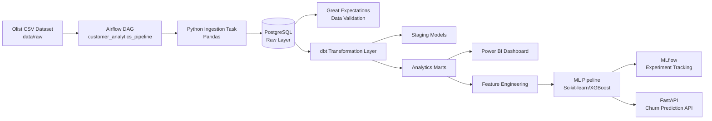

# Customer Analytics Platform


End-to-End Data Analytics & Machine Learning Platform

This project demonstrates an end-to-end analytics platform
built with modern data engineering, analytics and machine learning tools.

The goal is to analyze customer behavior, generate business insights,
and predict customer churn.
## Business Problem

E-commerce companies need to understand:

- Which customers generate the most value?
- Which products drive revenue?
- Which customers are at risk of churn?
- How can data support business decisions?

This project builds a complete analytics pipeline
to answer these questions.


## Architecture

```mermaid
flowchart LR

    A[Olist CSV Dataset<br/>data/raw] --> B[Airflow DAG<br/>customer_analytics_pipeline]

    B --> C[Python Ingestion Task<br/>Pandas]

    C --> D[(PostgreSQL<br/>Raw Layer)]

    D --> E[Great Expectations<br/>Data Validation]

    D --> F[dbt Transformation Layer]

    F --> F1[Staging Models]
    F --> F2[Analytics Marts]

    F2 --> G[Power BI Dashboard]

    F2 --> H[Feature Engineering]

    H --> I[ML Pipeline<br/>Scikit-learn/XGBoost]

    I --> J[MLflow<br/>Experiment Tracking]

    I --> K[FastAPI<br/>Churn Prediction API]

```


# Docker Services

| Service | Purpose |
|---|---|
| postgres | PostgreSQL database storing raw and transformed data |
| airflow | Workflow orchestration, ingestion, and dbt execution |
| churn_api | FastAPI service for churn prediction |


# Tech Stack

## Data Engineering

- Python
- PostgreSQL
- Docker
- Apache Airflow
- dbt
- Great Expectations


## Analytics

- SQL
- Pandas
- Power BI


## Machine Learning

- Scikit-learn
- XGBoost
- MLflow


## Deployment

- FastAPI
- Docker
- GitHub Actions

## Project Structure


customer-analytics-platform/

```
.
├── data
│   └── raw
│       └── dataset files
│
├── airflow
│   └── dags
│       └── customer_analytics_pipeline.py
│
├── src
│   └── ingestion scripts
│
├── customer_analytics_dbt
│   └── transformation models
│
├── ml
│   ├── feature engineering
│   ├── training
│   └── models
│
├── api
│   └── FastAPI service
│
├── dashboard
│   └── Power BI dashboard
│
└── docker-compose.yml
```
# Data Pipeline

## 1. Data Ingestion

Raw datasets are loaded into PostgreSQL using an automated Airflow ingestion task.

The ingestion task reads CSV files from:

```
data/raw/
```

Expected files:

```
data/
└── raw/
    ├── olist_orders_dataset.csv
    ├── olist_order_items_dataset.csv
    ├── olist_products_dataset.csv
    ├── olist_order_reviews_dataset.csv
    ├── olist_customers_dataset.csv
    ├── olist_sellers_dataset.csv
    ├── olist_geolocation_dataset.csv
    ├── olist_order_payments_dataset.csv
    └── product_category_name_translation.csv
```

The Airflow DAG loads raw Olist datasets into PostgreSQL.

---

## 2. Data Validation

Great Expectations validates data quality and consistency.

---

## 3. Data Transformation

dbt creates:

- staging models
- fact tables
- analytics marts
- business KPI models

---

## 4. Analytics

Business KPIs and customer analytics models are generated.

---

## 5. Machine Learning

Customer churn prediction is performed using engineered customer behavior features.

---
## Dashboard Preview


### Executive Overview


### Products 


# Machine Learning Model

## Problem

Customer churn prediction.


## Features

- Recency
- Frequency
- Monetary Value
- Average Order Value


## Models Tested

- Logistic Regression
- Random Forest
- XGBoost


## Evaluation Metrics

- Accuracy
- Precision
- Recall
- ROC-AUC


## Best Model

Random Forest


ROC-AUC:

0.67


# How To Run

## Prerequisites

Make sure you have installed:

- Docker Desktop
- Docker Compose


A `.env` file is required for database configuration.

No local Python environment is required because all services run inside Docker containers.

---

## 1. Clone Repository

```bash
git clone https://github.com/shokoufehyazdanian/Customer-Analytics-Platform.git
```

---

## 2. Environment Configuration

Create a `.env` file in the project root directory:

```env
POSTGRES_USER=postgres
POSTGRES_PASSWORD=postgres
POSTGRES_DB=customer_analytics

POSTGRES_HOST=postgres
POSTGRES_PORT=5432
```

---

## 3. Dataset Setup

Raw datasets are not included in this repository because of their size.

Download the Brazilian E-Commerce Public Dataset by Olist from Kaggle:

https://www.kaggle.com/datasets/olistbr/brazilian-ecommerce


Extract CSV files into:

```
data/raw/
```

---

## 4. Start Docker Services

Build and start all services:

```bash
docker compose up --build -d
```

This starts:

| Service | Description |
|---|---|
| PostgreSQL | Data warehouse database |
| Airflow | Workflow orchestration, ingestion, and dbt execution |
| FastAPI | Churn prediction API |

---

## 5. Run Automated Data Pipeline

Data ingestion, transformations, and data quality checks are orchestrated by Apache Airflow.

Open Airflow:

```
http://localhost:8080
```

Trigger the DAG:

```
customer_analytics_pipeline
```

The DAG executes:

```
ingestion
    |
    v
dbt_run
    |
    v
dbt_test
```

The pipeline automatically:

- loads raw CSV files into PostgreSQL
- runs dbt transformations
- creates analytics models
- executes dbt data quality tests

---

# Analytics Models

dbt creates analytical tables including:

- fact_orders
- mart_customer_rfm
- mart_customer_segments
- mart_sales_summary
- mart_product_performance


---

# Access Applications

## Airflow

Open:

```
http://localhost:8080
```


## FastAPI

Endpoint:

```
POST http://localhost:8000/docs
```


Example request:

```json
{
  "frequency": 30,
  "monetary": 5,
  "recency": 450,
  "avg_order_value": 90
}
```


Response:

```json
{
  "churn_prediction": 1,
  "probability": 0.51
}
```

---

# Stop Services

Stop all containers:

```bash
docker compose down
```

---

# Project Execution Flow

```
CSV Files
    |
    v
Airflow DAG
    |
    v
Python Ingestion Task
    |
    v
PostgreSQL Raw Layer
    |
    v
dbt Transformations
    |
    v
Analytics Models
    |
    v
Machine Learning Model
    |
    v
FastAPI Prediction API
```

All components run inside Docker containers and are orchestrated through Apache Airflow to provide a reproducible automated pipeline.

---

# Future Improvements

- Cloud deployment (AWS/Azure)
- Data warehouse migration
- Real-time streaming pipeline
- Advanced ML monitoring
- Automated retraining
